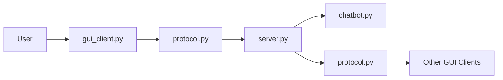
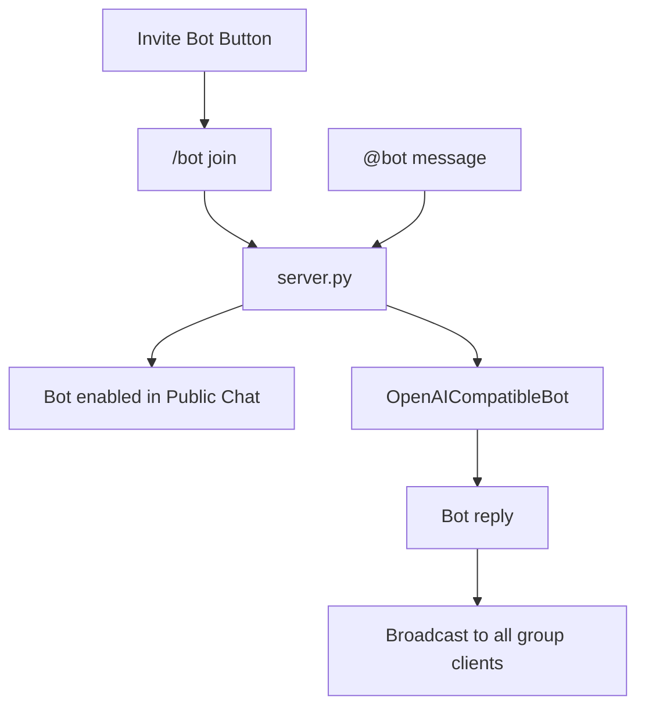

# System Structure Explanation

## Overview

This project is a socket-based distributed chat system with a Tkinter GUI. The latest version uses a clearer conversation model:

- a default public group chat
- direct messages between online users
- server-side group chatbot support
- structured JSON-line messages shared by all modules

## Module Responsibilities

### `protocol.py`

`protocol.py` defines the message format used by both the server and GUI clients.

Each packet is one JSON object followed by a newline. The protocol now includes common conversation fields:

- `type`: message type, such as `login`, `chat`, `command`, `user_list`, or `room_list`
- `sender`: who sent the message
- `content`: message body
- `conversation_type`: `group`, `direct`, or `system`
- `conversation_id`: stable id for a group or direct conversation
- `target`: direct-message target user when needed
- `metadata`: extra structured data, such as online users or room lists

The module also limits message size and handles invalid JSON lines more gracefully, which makes socket communication safer during demos.

### `server.py`

`server.py` is the communication center. It accepts multiple TCP clients, creates one thread per connection, and routes messages according to the conversation fields.

Main responsibilities:

- register usernames and handle duplicated names
- broadcast messages in the public group chat
- send direct messages to selected online users
- maintain recent history for each conversation
- provide `/who`, `/summary`, `/keywords`, `/rooms`, and bot commands
- broadcast online user lists so the GUI sidebar stays updated
- host the group chatbot on the server

The server-side bot makes the chatbot a real group participant. After a user clicks `Invite Bot` or sends `/bot join`, anyone in the public group can mention `@bot` and the bot reply is broadcast to all clients.

### `gui_client.py`

`gui_client.py` is the Tkinter desktop client. Its layout now follows a WeChat-like structure:

- left sidebar for connection controls, group chats, and online friends
- right panel for the selected conversation
- upper toolbar above the input box for extra features
- large chat area for real-time messages
- multi-line input box and send button

Users can select `Public Chat` for group messages or click an online friend for direct messages. The GUI stores messages by `conversation_id`, so switching between conversations keeps each chat view separate.

### `chatbot.py`

`chatbot.py` contains the reusable chatbot and sentiment logic.

Main parts:

- `SimpleContextBot`: local fallback bot with personality and short conversation context
- `OpenAICompatibleBot`: optional API-backed bot using OpenAI-compatible chat completions
- `analyze_sentiment`: rule-based Positive/Neutral/Negative tagger

The chatbot history now has a maximum length, so long demos do not grow memory forever. It also records whether the latest reply came from the API, local mode, or fallback mode.

## Runtime Flow

## Group Bot Flow

## Robustness Improvements

- The protocol has default fields for future extensions.
- Oversized messages are rejected before they can consume too much memory.
- Invalid JSON lines no longer crash normal message handling.
- Server-side login acknowledgement updates the GUI username after duplicate-name resolution.
- Online user lists are pushed to every client after join/leave.
- Chatbot history is capped.
- API chatbot failures fall back to local responses.
- The GUI supports disconnect and reconnect.
- Messages are separated by conversation id, which prepares the project for more group rooms, file transfer, AI image generation, or multiplayer game messages later.
